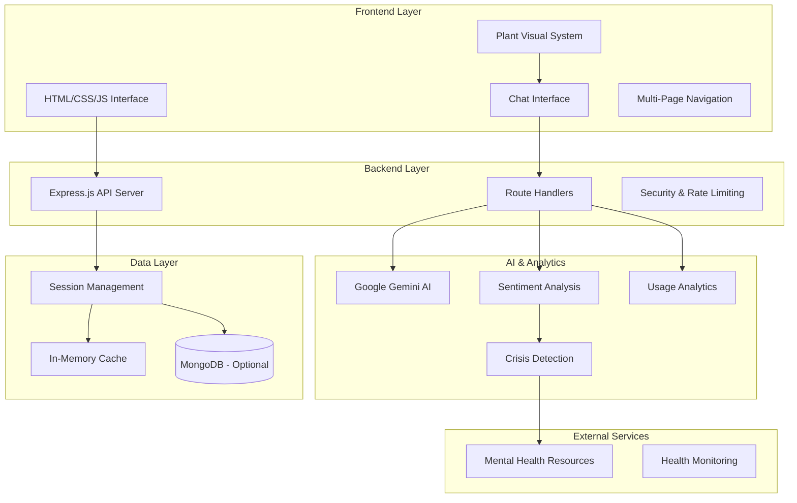

# Design Document

## Overview

The Plant Companion application is a full-stack web application that combines AI-powered conversational therapy with an interactive plant growth visualization system. The application provides mental health support through an engaging plant companion that grows and changes based on user emotions and interactions. The system integrates Google Gemini AI for intelligent responses, implements comprehensive sentiment analysis, and provides crisis intervention capabilities.

## Architecture

### High-Level Architecture



### Technology Stack

**Frontend:**
- Vanilla JavaScript (ES6+) for maximum performance and compatibility
- Modern CSS3 with animations and responsive design
- HTML5 with semantic structure and accessibility features
- Font Awesome icons and Google Fonts for visual enhancement

**Backend:**
- Node.js runtime environment
- Express.js web framework with comprehensive middleware
- Google Gemini AI API for natural language processing
- Winston logging for comprehensive error tracking
- Helmet for security headers and CORS for cross-origin requests

**Data Management:**
- In-memory session management with Map data structures
- Optional MongoDB integration for persistent storage
- Redis support for distributed session management (production)

**Deployment:**
- Docker containerization for consistent environments
- Multiple deployment targets (Vercel, Railway, Heroku, Google Cloud)
- Environment-based configuration management

## Components and Interfaces

### Frontend Components

#### 1. Plant Visual System
**Purpose:** Interactive plant companion that responds to user emotions and grows over time

**Key Features:**
- SVG-based plant rendering with pot, stem, leaves, and optional flowers
- Dynamic growth animations based on conversation sentiment
- Clickable interactions that trigger encouraging responses
- Mood-based visual changes (colors, animations, effects)
- Achievement system with visual milestones

**Implementation:**
```javascript
class PlantCompanion {
  constructor(containerId) {
    this.container = document.getElementById(containerId);
    this.growthLevel = 20; // Starting growth percentage
    this.mood = 'curious';
    this.achievements = [];
  }
  
  updateMood(sentiment) {
    // Update plant appearance based on sentiment
  }
  
  grow(amount) {
    // Animate plant growth with smooth transitions
  }
  
  handleClick() {
    // Respond to user interactions
  }
}
```

#### 2. Chat Interface System
**Purpose:** Real-time messaging interface with AI integration

**Key Features:**
- Message input with validation and character limits
- Real-time message display with typing indicators
- Loading states and error handling
- Message history with smooth scrolling
- Responsive design for all screen sizes

**Implementation:**
```javascript
class ChatInterface {
  constructor() {
    this.messages = [];
    this.isLoading = false;
    this.sessionId = this.generateSessionId();
  }
  
  async sendMessage(content) {
    // Send message to API and handle response
  }
  
  addMessage(content, sender) {
    // Add message to UI with animations
  }
  
  showLoading(show) {
    // Toggle loading indicators
  }
}
```

#### 3. Navigation System
**Purpose:** Multi-page navigation without page reloads

**Key Features:**
- Single Page Application (SPA) navigation
- Smooth transitions between pages
- State preservation across navigation
- Responsive navigation menu

**Pages:**
- **Chat Page:** Main interaction with plant and AI
- **Garden Page:** Achievements and growth history
- **Insights Page:** Analytics and emotional patterns
- **About Page:** Application information and resources

### Backend Components

#### 1. Chat API Handler
**Purpose:** Process messages, integrate with AI, and manage conversations

**Endpoints:**
- `POST /api/chat/message` - Send message and receive AI response
- `GET /api/chat/session/:id` - Retrieve session history
- `DELETE /api/chat/session/:id` - Clear session data

**Key Features:**
- Google Gemini AI integration with fallback responses
- Advanced sentiment analysis and topic detection
- Crisis intervention with automatic resource provision
- Rate limiting and input validation
- Session management with persistence

#### 2. Analytics System
**Purpose:** Track usage patterns and provide insights

**Endpoints:**
- `POST /api/analytics/track` - Track user interactions
- `GET /api/analytics/dashboard` - Usage overview
- `GET /api/analytics/topics` - Topic analysis
- `GET /api/analytics/usage` - Usage patterns

**Metrics Tracked:**
- Message volume and frequency
- Sentiment distribution over time
- Topic trends and patterns
- Session duration and engagement
- Crisis intervention frequency

#### 3. Resources API
**Purpose:** Provide mental health resources and support information

**Endpoints:**
- `GET /api/resources/helplines` - Crisis helplines
- `GET /api/resources/professionals` - Professional services
- `GET /api/resources/self-help` - Coping strategies
- `GET /api/resources/search` - Search all resources

## Data Models

### Session Model
```javascript
{
  sessionId: String,
  messages: [{
    role: 'user' | 'assistant',
    content: String,
    timestamp: Date,
    sentiment: String,
    topics: [String],
    copingStrategy: String,
    resources: Boolean
  }],
  analytics: {
    totalMessages: Number,
    crisisDetected: Boolean,
    resourcesAccessed: Boolean,
    topTopics: [String],
    sentimentHistory: [String]
  },
  createdAt: Date,
  lastActivity: Date,
  metadata: {
    userAgent: String,
    ipAddress: String,
    plantGrowthLevel: Number,
    achievements: [String]
  }
}
```

### Plant State Model
```javascript
{
  growthLevel: Number, // 0-100 percentage
  mood: String, // 'happy', 'sad', 'excited', 'curious', 'stressed'
  name: String, // Changes based on growth level
  achievements: [{
    id: String,
    name: String,
    description: String,
    unlockedAt: Date,
    icon: String
  }],
  visualState: {
    stemHeight: Number,
    leafCount: Number,
    hasFlower: Boolean,
    colorScheme: String,
    animationState: String
  }
}
```

### Analytics Model
```javascript
{
  date: String, // YYYY-MM-DD
  metrics: {
    totalMessages: Number,
    uniqueSessions: Number,
    avgSessionDuration: Number,
    crisisInterventions: Number
  },
  sentiment: {
    positive: Number,
    negative: Number,
    neutral: Number,
    crisis: Number
  },
  topics: {
    'academic-stress': Number,
    'family-issues': Number,
    'anxiety': Number,
    'depression': Number,
    'relationships': Number,
    'career': Number,
    'self-esteem': Number
  },
  hourlyDistribution: [Number] // 24 elements for each hour
}
```

## Error Handling

### Frontend Error Handling
- Network connectivity issues with retry mechanisms
- API timeout handling with graceful degradation
- Input validation with user-friendly error messages
- Fallback UI states for when features are unavailable
- Progressive enhancement for older browsers

### Backend Error Handling
- Comprehensive logging with Winston for all errors
- Graceful API failures with meaningful error responses
- Rate limiting with clear retry-after headers
- Input validation with detailed error messages
- Database connection failure handling
- AI API failure fallbacks with rule-based responses

### Crisis Intervention Protocol
1. **Detection:** Keyword-based crisis detection in real-time
2. **Immediate Response:** Provide supportive message and resources
3. **Resource Provision:** Display crisis helplines and emergency contacts
4. **Logging:** Secure logging for monitoring and improvement
5. **Follow-up:** Continued supportive messaging in subsequent interactions

## Testing Strategy

### Frontend Testing
- **Unit Tests:** Individual component functionality
- **Integration Tests:** Component interaction and data flow
- **UI Tests:** User interaction scenarios and accessibility
- **Performance Tests:** Loading times and animation smoothness
- **Cross-browser Tests:** Compatibility across modern browsers
- **Responsive Tests:** Functionality across different screen sizes

### Backend Testing
- **API Tests:** Endpoint functionality and response validation
- **Integration Tests:** Database and external service integration
- **Load Tests:** Performance under concurrent user load
- **Security Tests:** Input validation and injection prevention
- **AI Integration Tests:** Gemini API integration and fallback scenarios

### End-to-End Testing Scenarios
1. **Complete Chat Flow:** User sends message → AI responds → Plant grows
2. **Crisis Detection:** Crisis message → Resources displayed → Appropriate response
3. **Multi-page Navigation:** Navigate between pages → State preserved
4. **Plant Interaction:** Click plant → Encouraging message → Visual feedback
5. **Session Management:** Long conversation → Session persisted → History maintained
6. **Error Recovery:** Network failure → Fallback response → Retry success

## Security Considerations

### Input Security
- Message content sanitization to prevent XSS attacks
- Input length limits to prevent DoS attacks
- Rate limiting to prevent spam and abuse
- CSRF protection for all API endpoints

### Data Privacy
- No persistent storage of sensitive personal information
- Session data encryption in transit and at rest
- Anonymized analytics data collection
- GDPR-compliant data handling practices

### API Security
- Helmet.js for security headers
- CORS configuration for allowed origins
- API key protection for external services
- Request validation and sanitization

## Performance Optimization

### Frontend Optimization
- Lazy loading of non-critical resources
- CSS and JavaScript minification
- Image optimization and compression
- Efficient DOM manipulation and event handling
- Smooth animations with CSS transforms and GPU acceleration

### Backend Optimization
- Response compression with gzip
- Efficient session management with memory caching
- Database query optimization
- API response caching where appropriate
- Connection pooling for external services

### Monitoring and Analytics
- Real-time performance monitoring
- Error tracking and alerting
- Usage analytics for optimization insights
- Health check endpoints for uptime monitoring

## Deployment Architecture

### Development Environment
- Local development server with hot reloading
- Environment variable configuration
- Development-specific logging and debugging
- Mock data for testing scenarios

### Production Environment
- Docker containerization for consistent deployment
- Environment-based configuration management
- Production logging with log rotation
- Health monitoring and alerting
- Automated backup and recovery procedures

### Scalability Considerations
- Horizontal scaling with load balancers
- Database sharding for large user bases
- CDN integration for static asset delivery
- Microservices architecture for future expansion
- Caching strategies for improved performance